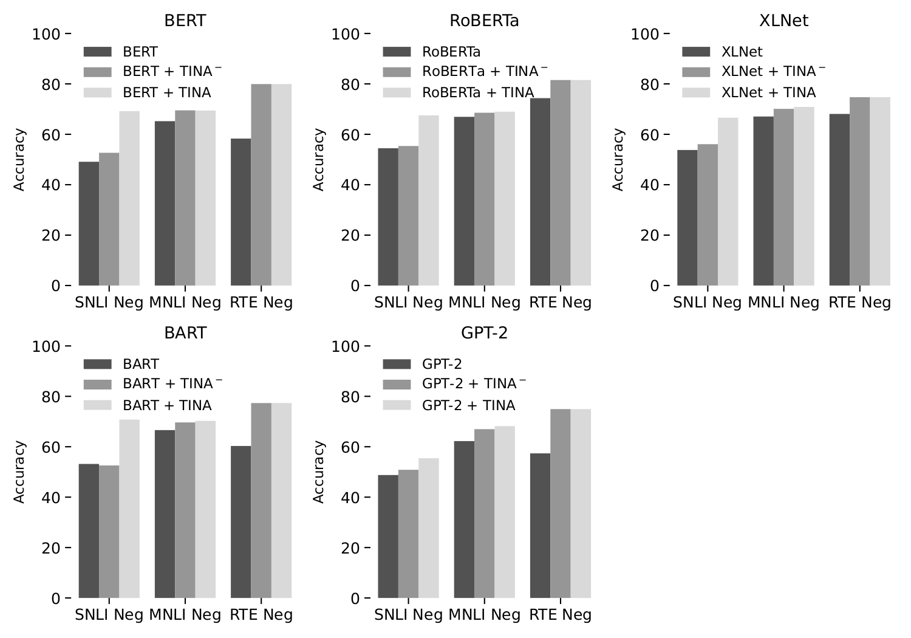

# TINA: Textual Inference with Negation Augmentation

Transformer-based language models achieve state-of-the-art results on several natural language processing tasks. One of these is <em>textual entailment</em>, i.e., the task of determining whether a premise logically entails a hypothesis. However, the models perform poorly on this task when the examples contain negations. In this paper, we propose a new definition of textual entailment that captures also negation. This allows us to develop TINA (Textual Inference with Negation Augmentation), a principled technique for negated data augmentation that can be combined with the unlikelihood loss function. Our experiments with different transformer-based models show that our method can significantly improve the performance of the models on textual entailment datasets with negation -- without sacrificing performance on datasets without negation.



## How to Use TINA

### Augmenting Datasets

#### Step 1: Extract Sentences

```bash
python cli.py --extract_sentences --input_1 data/nli/train_rte.csv --output extracted_train_rte.txt
```

#### Step 2: Format to ConLL-U

```bash
python cli.py --convert_to_conllu --input_1 train_extracted_rte.txt --output conllu_train_rte.txt
```

#### Step 3: Negate

```bash
python cli.py --negate --input_1 conllu_train_rte.txt --output negated_train_rte.tsv
```

#### Step 4: Reformat Negated Dataset

```bash
python cli.py --reformat_negation_dataset --input_1 negated_train_rte.tsv --input_2 data/nli/train_rte.csv --output negated_formated_train_rte.csv --task rte
```

#### Step 5: Remove Testing Negated Instances in Training Negated Instances

```bash
python cli.py --check_negation_dataset --input_1 negated_formated_train_rte.csv --input_2 data/negated_nli/RTE.txt --output checked_negated_formated_train_rte.csv
```

#### Step 6: Check Grammar

```bash
python cli.py --check_grammar --input_1 checked_negated_formated_train_rte.csv  --output grammar_checked_negated_formated_train_rte.csv --device cpu
```

#### Step 7: Data Augmentation

```bash
python cli.py --data_augmentation --input_1 grammar_checked_negated_formated_train_rte.csv --output train_rte_negation_augmented.csv --task rte
```

### Finetuning Models

#### Without Splitting

```bash
python cli.py --finetune --model bert-base-cased  --task rte --learning_rate 1e-4 --epochs 10 --weight_decay 0 --batch_size 8  --runs 2 --device cpu
```

#### With Splitting (Train/Val)

```bash
python cli.py --finetune --model bert-base-cased  --task rte --learning_rate 1e-4 --epochs 10 --weight_decay 0 --batch_size 8  --runs 2 --device cpu --split
```

### Finetuning Models with TINA Minus

#### Without Splitting

```bash
python cli.py --finetune_with_tina_minus --model bert-base-cased  --task rte --learning_rate 1e-4 --epochs 10 --weight_decay 0 --batch_size 8  --runs 2 --device cpu
```

#### With Splitting (Train/Val)

```bash
python cli.py --finetune_with_tina_minus --model bert-base-cased  --task rte --learning_rate 1e-4 --epochs 10 --weight_decay 0 --batch_size 8 --runs 2 --device cpu --split
```

### Finetuning Models with TINA

#### Without Splitting

```bash
python cli.py --finetune_with_tina --model bert-base-cased  --task rte --learning_rate 1e-4 --epochs 10 --weight_decay 0 --batch_size 8 --runs 2 --device cpu
```

#### With Splitting (Train/Val)

```bash
python cli.py --finetune_with_tina --model bert-base-cased  --task rte --learning_rate 1e-4 --epochs 10 --weight_decay 0 --batch_size 8 --runs 2 --device cpu --split
```

## Citing

If you want to cite TINA, please refer to the publication in the [Findings of the Empirical Methods in Natural Language Processing](https://2022.emnlp.org/):

```code
@inproceedings{helwe2022logitorch,
  title={TINA: Textual Inference with Negation Augmentation},
  author={Helwe, Chadi and Coumes, Simon and Clavel, Chlo\'e and Suchanek, Fabian},
  booktitle={Findings of the Association for Computational Linguistics: EMNLP 2022},
  year={2022}
}
```

## Acknowledgments

This work was partially funded by ANR-20-CHIA-0012-01 (“NoRDF”).
